# Evidências de execução real na AWS

Esta pasta reúne prints reais do console AWS, capturados diretamente da conta usada neste case (`952376464712`, região `us-east-2`). Servem de complemento visual ao [`docs/test_log.md`](../test_log.md), que já registra cada comando e resultado em texto — aqui está a mesma evidência, mas visível de relance para quem não vai rodar nenhum comando.

Nem todos os itens que eu havia planejado capturar entraram nesta rodada (ver seção "O que ficou de fora" no fim). O que está aqui é 100% real — nenhuma imagem foi encenada ou editada.

## 1. Step Functions — pipeline orquestrado, execução real bem-sucedida

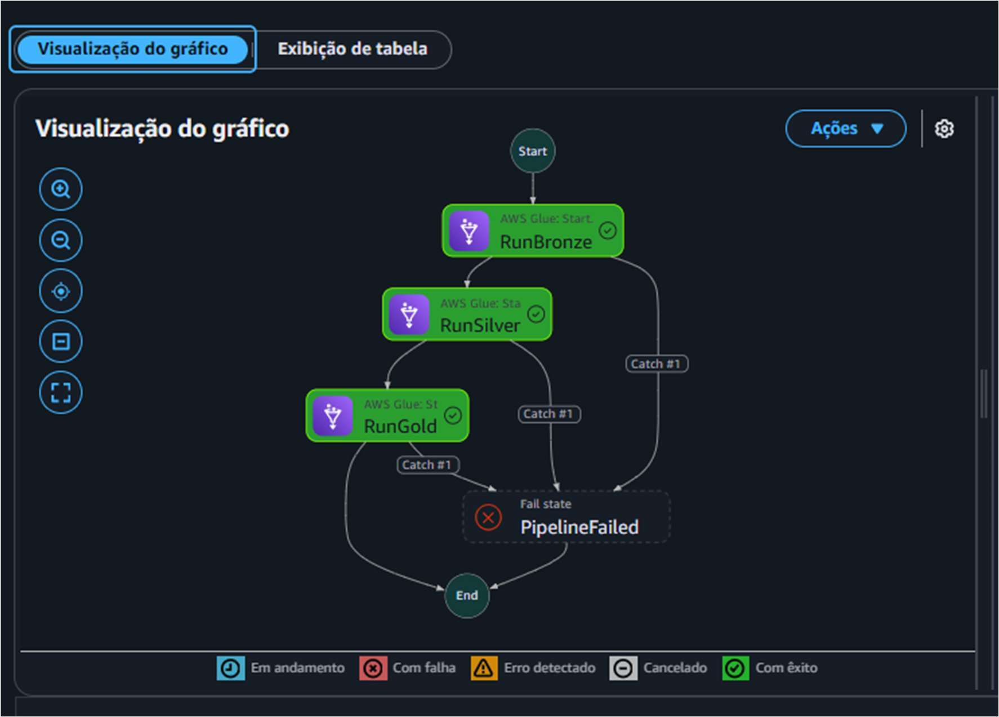

Máquina de estados `pod99-fin-case-dev-pipeline`, as 3 etapas (`RunBronze` → `RunSilver` → `RunGold`) em verde ("Com êxito"). É a prova visual mais direta de que o pipeline inteiro roda ponta a ponta sem intervenção manual. Referência: [`test_log.md` §4.15](../test_log.md).

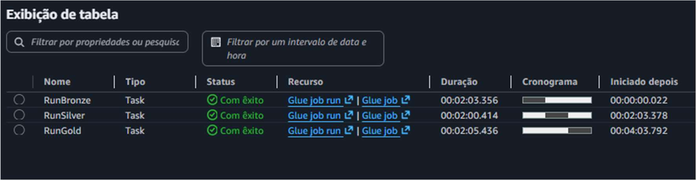

Mesma execução, visão em tabela: durações de cada etapa (RunBronze 2min03s, RunSilver 2min00s, RunGold 2min05s) e o encadeamento (`Iniciado depois` mostra RunSilver começando só depois do RunBronze terminar, confirmando a orquestração sequencial).

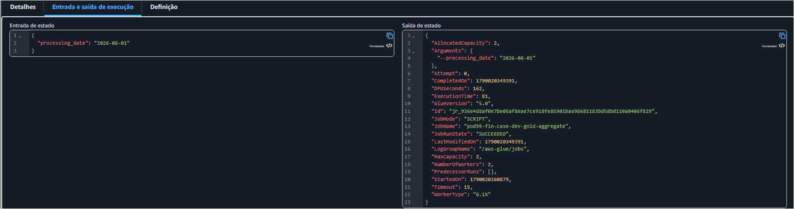

Detalhe do estado `RunGold`: a entrada (`"processing_date": "2026-08-01"`) chegando corretamente até a última etapa do pipeline, e a saída completa do job Glue (`DPUSeconds: 162`, `JobRunState: SUCCEEDED`). Esta é a evidência direta de que a correção do bug de `ResultPath` (documentado no [ADR-008](../../architecture/ADRs/008-partitioning-idempotency-strategy.md) e em [`test_log.md` §4.13-4.14](../test_log.md)) realmente funcionou — sem ela, essa tela mostraria `processing_date` ausente na entrada do RunGold.

## 2. Athena — consulta real contra as 6 tabelas do pipeline

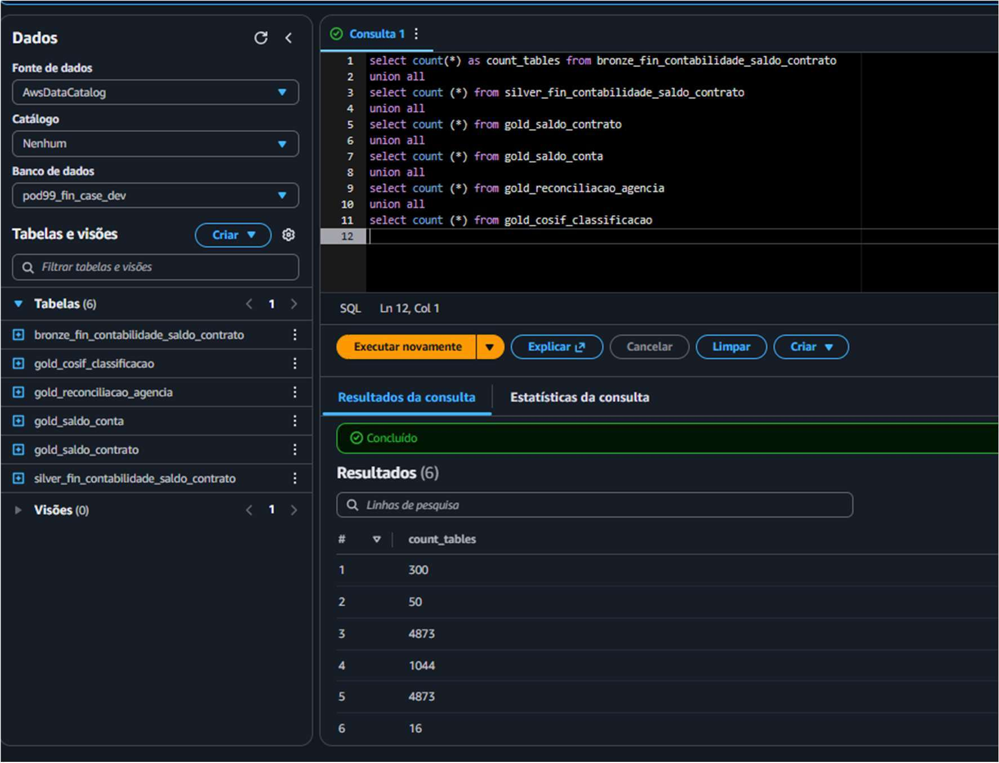

Uma única query (`UNION ALL` de `COUNT(*)`) contra as 6 tabelas do projeto, rodada direto no editor do Athena. Os 6 valores retornados — `300, 50, 4873, 1044, 4873, 16` — batem exatamente com os números já validados e documentados: `bronze` e `silver` = 4.873 linhas cada, `gold_saldo_contrato` = 1.044, `gold_saldo_conta` = 300, `gold_reconciliacao_agencia` = 50, `gold_cosif_classificacao` = 16.

**Nota técnica**: `UNION ALL` sem `ORDER BY` não garante que a ordem das linhas do resultado bata com a ordem das queries no texto do SQL — por isso os números aparecem "fora de ordem" na tela em relação à ordem das 6 tabelas listadas. Confirmei a correspondência batendo cada valor contra os totais documentados em [`test_log.md`](../test_log.md) e no [`README.md`](../../README.md) (seção de dimensionamento/validação) — todos batem.

## 3. Glue — os 3 jobs e seu histórico real de execuções

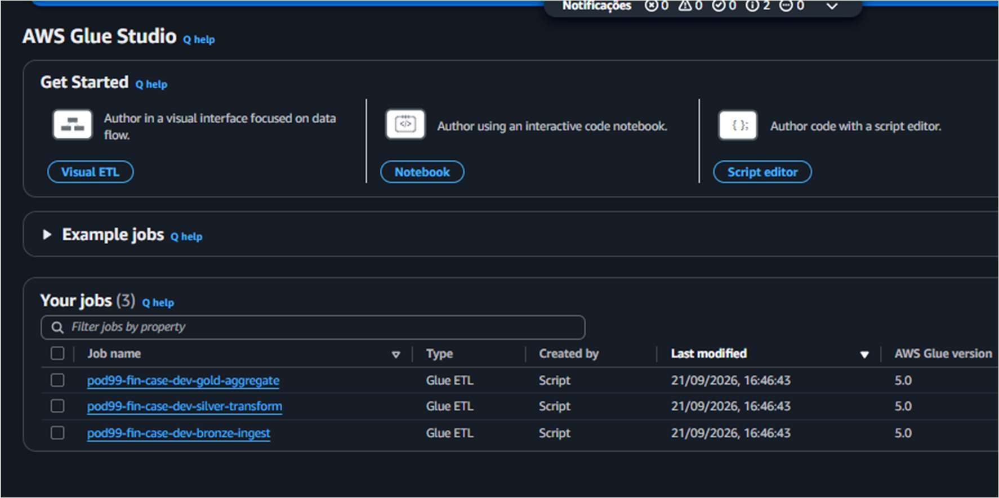

Os 3 jobs (`bronze-ingest`, `silver-transform`, `gold-aggregate`) provisionados via Terraform, visíveis no AWS Glue Studio.

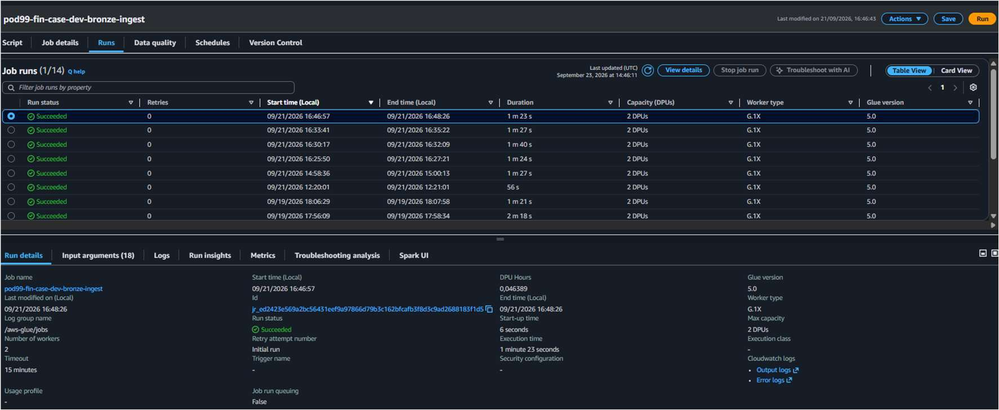

`pod99-fin-case-dev-bronze-ingest`: **14 execuções reais** (a maioria dos debugs documentados no `test_log.md` — falhas de configuração corrigidas uma a uma, mais as execuções de validação e idempotência).

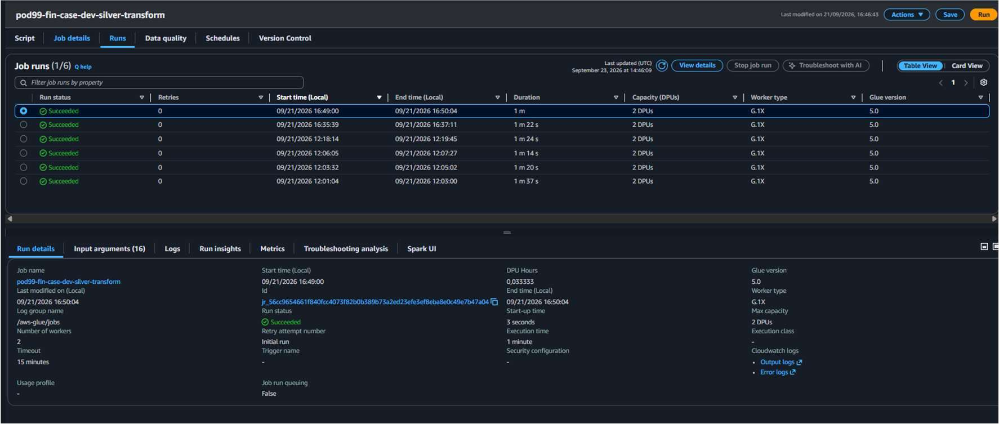

`pod99-fin-case-dev-silver-transform`: **6 execuções reais**.

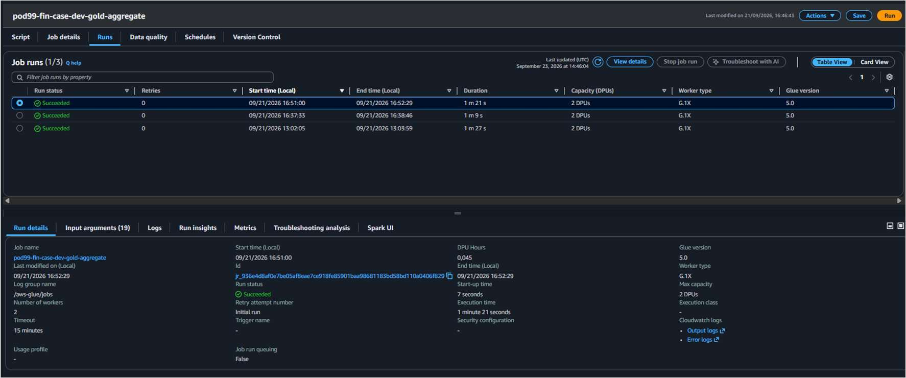

`pod99-fin-case-dev-gold-aggregate`: **3 execuções reais**.

Esses números de execuções (14/6/3) são exatamente os mesmos usados no cálculo de custo real do `README.md` (soma de `DPUSeconds` via `aws glue get-job-runs` → ≈1,06 DPU-hora ≈ US$0,47 estimado — ver também o Cost Explorer real na seção 6 abaixo, que mostra US$0,31).

## 4. DynamoDB — controle de lote gravando de verdade

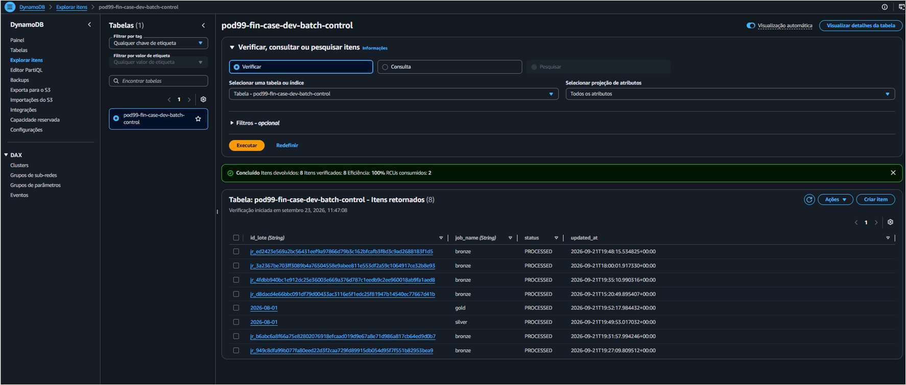

`pod99-fin-case-dev-batch-control`, 8 itens reais retornados. Note os diferentes formatos de `id_lote`: para o Bronze é o `JOB_RUN_ID` do Glue (`jr_...`, um por execução — decisão documentada no [ADR-008](../../architecture/ADRs/008-partitioning-idempotency-strategy.md)), para Silver/Gold é a data de negócio (`2026-08-01`). Todos com `status: PROCESSED`.

## 5. CloudWatch — alarme de falha, com histórico real de um alarme disparando

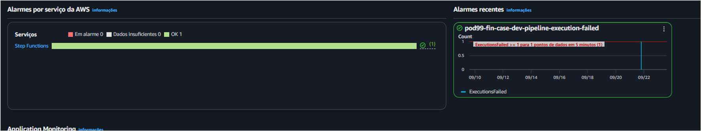

Visão geral: 1 alarme configurado (`pod99-fin-case-dev-pipeline-execution-failed`), no serviço Step Functions, atualmente `OK`.

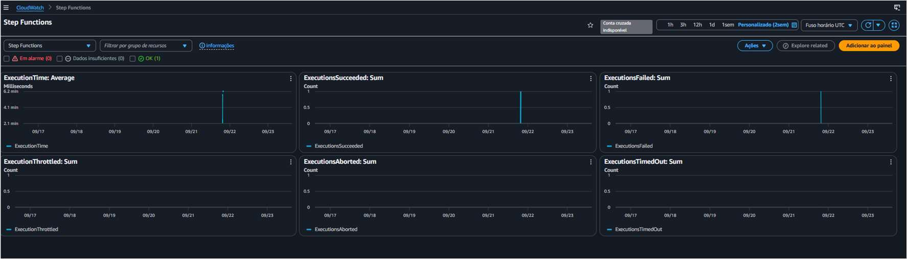

Métricas nativas (`ExecutionTime`, `ExecutionsSucceeded`, `ExecutionsFailed`) — repare o pico real em `ExecutionsFailed` por volta de 09/22: **essa é a métrica capturando, de verdade, a primeira execução real do pipeline que falhou** por causa do bug de `ResultPath` (ver item 1 acima e [`test_log.md` §4.13](../test_log.md)). Não é um dado simulado — é o CloudWatch registrando o incidente real que documentei e corrigi.

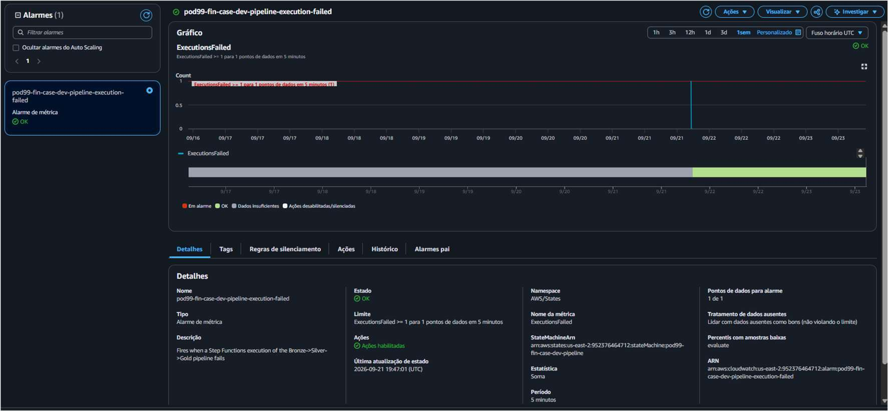

O mesmo alarme, aberto: estado `OK`, com o histórico completo mostrando a transição de `Em alarme` (cinza/indefinido no início) para `OK` depois que as execuções corrigidas passaram a suceder. `StateMachineArn` e `ARN` do alarme visíveis, confirmando que está de fato ligado à máquina de estados real deste projeto.

## 6. Custo real — Cost Explorer

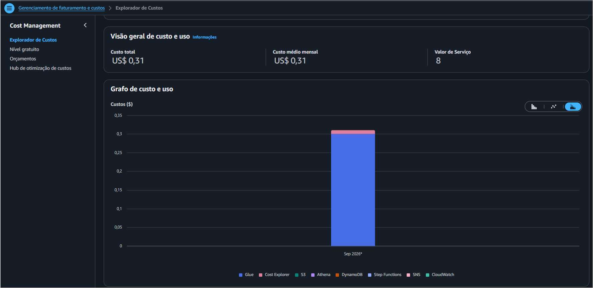

**Custo total real do projeto: US$ 0,31**, com a maior parte (barra azul) atribuída ao Glue — consistente com o cálculo feito a partir de `DPUSeconds` no `README.md` (≈US$0,47 estimado a partir de DPU-segundos faturados; o valor real do Cost Explorer, US$0,31, é a fonte de verdade mais confiável, e ambos confirmam a mesma ordem de grandeza: bem abaixo de US$1). Os demais serviços (S3, Athena, DynamoDB, Step Functions, SNS, CloudWatch) aparecem na legenda com custo residual, dentro do tier gratuito.

## 7. S3 — estrutura física do data lake

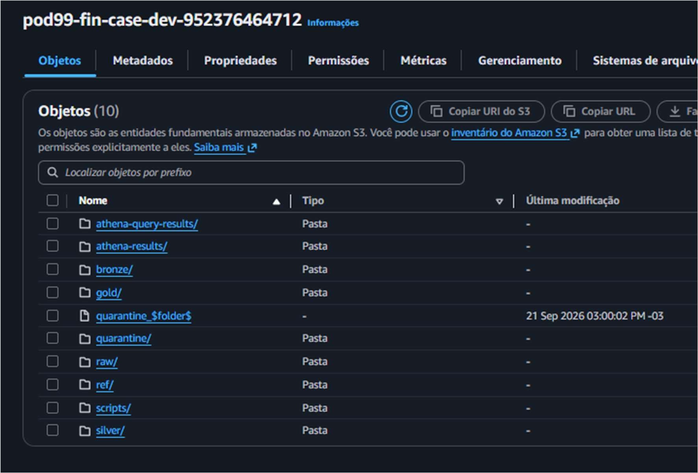

O bucket `pod99-fin-case-dev-952376464712` com os prefixos `raw/`, `bronze/`, `silver/`, `gold/`, `quarantine/`, `ref/` — exatamente a estrutura Medallion descrita no [diagrama de arquitetura](../../architecture/diagram.mmd). `athena-query-results/` e `athena-results/` são artefatos operacionais do Athena (resultados de consulta), não parte do data lake em si.

## O que ficou de fora desta rodada

- **Gráfico de uma métrica customizada** (namespace `Pod99FinCase`, ex. `records_processed`) — capturei as métricas *nativas* do Step Functions (item 5 acima), que na verdade acabaram sendo uma evidência mais interessante (mostram o bug real do `ResultPath` acontecendo), mas não uma métrica customizada publicada pelos jobs via `jobs/common/metrics.py`. Documentado como pendente.
- **GIF/vídeo de uma execução completa** — não gravado nesta rodada.

Nenhum desses dois itens é essencial: a evidência em texto ([`test_log.md` §4.16-4.18](../test_log.md)) já cobre a validação real das métricas customizadas (`aws cloudwatch list-metrics` + `get-metric-statistics` confirmando `records_processed=4873`).
